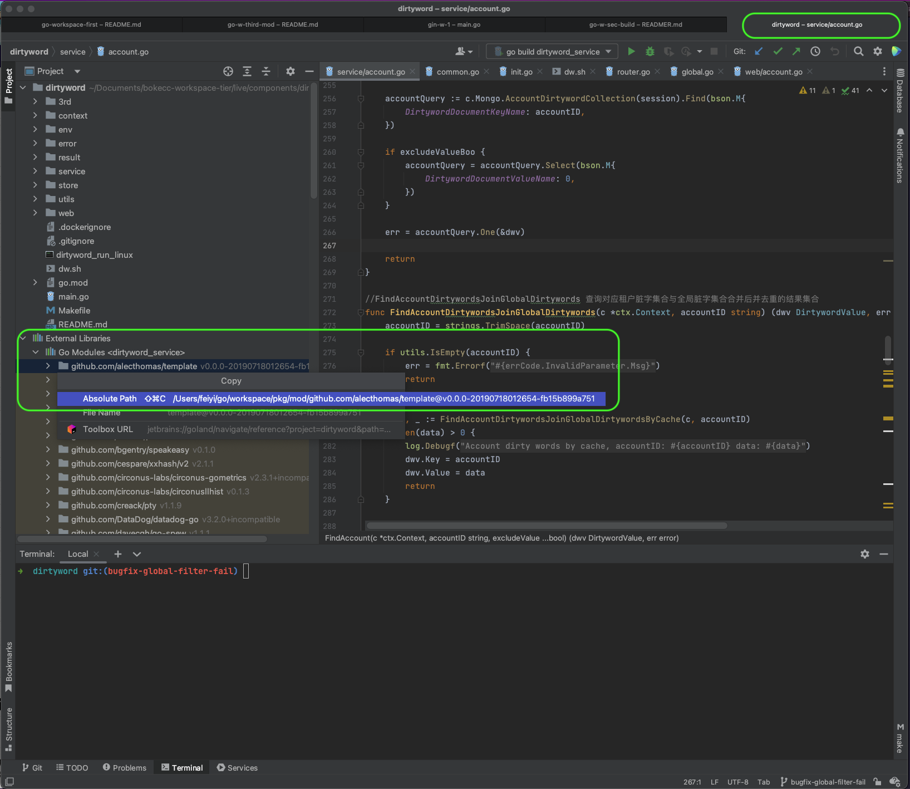

# go mod 学习笔记
>[参考1](https://zhuanlan.zhihu.com/p/482014524)
### part-1
* src pkg bin 应该是使用原来GOPATH的结构。现在都用go.mod就不用这个结构了吧
* GO111MODULE=auto，默认。如果当前文件在包含go.mod文件的目录下面，则按照GO111MODULE=on处理
* GO111MODULE=on，go命令行会使用modules，而一点也不会去GOPATH目录下查找。
* 当modules功能启用时，依赖包的存放位置变更为$GOPATH/pkg/mod/
* 如下展示了dirtyword项目的依赖库的位置

### part-2
* func main 必须在main包下
* 外部可调用的，即是可导出的；可导出的，函数名首字母都必须大写

### part-3
* create go.mod：go mod init github.com/sidabw/go-w-third-mod
* create go.sum：go mod tidy
* 完事了，可以运行main.go了
* 拉包拉不下来可以：go env -w GOPROXY=https://goproxy.io,direct